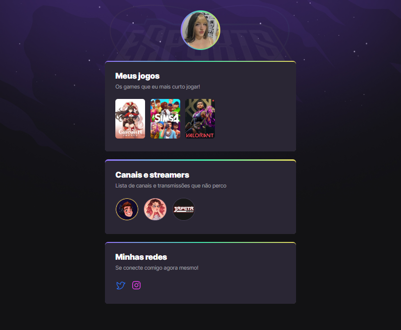

# NLW eSports 

> Trilha Explorer

Projeto construído do evento Next Level Week do Rocketseat.

[Clique para acessar](https://whoeduma.githubio/nlw-esports-explore/)

## ⛓ Tecnologias

- HTML
- CSS
- Git e Github

## ✨ O que aprendi durante essa jornada de 1 semana

- Não sabia muito bem a diferença entre FRONT-END x BACK-END, entendi que o cliente é o FRONT-END e o servidor é o BACK-END. Logo na minha concepção os dois precisam um do outro para funcionar!
- Como ja sabia muito sobre HTML e CSS não anotei tudo! Mas foi bom dar uma treinada e relembrar as funcionalidades.
- Em contra partida, não sabia usar muito bem animação no CSS. Aprendi como usar o @keyframe e o nth-child().

   ↪ Para criar animações no css precisa definir animação e nome, falar aonde ela vai começar e onde vai terminar. Tem que ter pelo menos 2 propriedades (nome e tempo), pode colocar um delay(atraso da animação) e sempre que colocar o delay é importante puxar algumas propriedades para ter um comportamento legal.

   ↪ O nth-child() é usado para combinar elementos baseado de acordo com o grupo de filhos.

- Também aprendi mais sobre o github e sobre git.

## 🍙 Contatos

Eduardamartinsmoreira53@gmail.com
